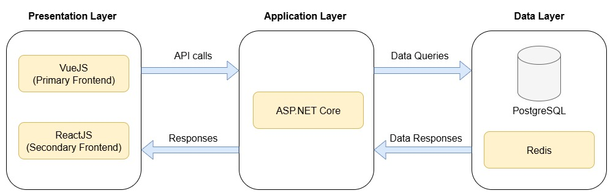

# Sprint 0 Worksheet

## Repository Link

Our project is planned to be a monorepo. The link is here: https://github.com/seigfrieds/OurCity

## Presentation Slides

[Check out the presentation slides here](./OurCity_Presentation.pdf)

## Project Summary & Vision

__OurCity__ will be a web application that provides users with an alternative to raising municipal concerns and making general quality of life suggestions, with the goal of making Winnipeg a stronger city.

While Winnipeg has 311, it is mainly for getting information about already existing city services, making service requests, and reporting various issues (e.g. potholes). We lack a definitive, easy-to-use platform where suggestions for new projects can be made to improve our overall quality of life. For that, currently, citizens of Winnipeg either have to email or call their local representatives. This can be inefficient and time-consuming, which results in many people not even bothering to voice their ideas. Some citizens also try to raise suggestions on various social media platforms such as Reddit, Twitter, and Facebook, but these platforms lack legitimacy and/or a clear, singular focus on taking proposals.

OurCity remedies this by providing an official hub for the citizens. It will allow users to create forum-like posts that contain their municipal suggestions (e.g. my neighborhood is lacking a modern recreational center) where other users can interact with each other through interactions like comments and upvotes. This provides an efficient way to keep track of issues and encourages people from the community to have lively discussions. Posts that meet or pass a certain user approval threshold can then be raised to their respective city representatives.

## Features & User Stories

### Core Feature: Post Management

| User Story | Acceptance Criteria |
| - | - |
| As a citizen, I want to be able to create posts so that I can suggest municipal improvements for Winnipeg. | Given I am logged into the system, when I click on the “New” button, complete the required fields, and click on the “Post” button, then my post is published successfully. |
| As a post author, I want to be able to edit my posts so that I can correct any mistakes and/or add additional information. | Given I am viewing my post, when I click on the “Edit” button, update the desired fields, and click on the “Save” button, then the updated information is stored and displayed. |
| As a post author, I want to be able to delete my posts so that I can discard changes I do not want anymore. | Given I am viewing my post, when I click on the “Delete” button and confirm the deletion, then the post is permanently removed and no longer visible to others. |
| As a post author, I want to be able to save private drafts for my posts so that I can return later and finish my post without losing progress. | Given I am creating or editing a post, when I click on the “Save Draft” button, then the current content is saved privately and not published. |

### Core Feature: Post Interaction

| User Story | Acceptance Criteria |
| - | - |
| As a user, I want to be able to view the details for an existing post so that I can learn about what it is suggesting. | Given I am on the dashboard, when I select a post, then the post’s details including title, description, location, images, engagement metrics, and more are displayed. |
| As a user, I want to be able to comment on posts so that I can further discuss ideas with other users. | Given I am viewing a post, when I click on the “Comment” or ”Reply” button, write a comment, and click on the “Post” button, then my comment will show up in the post’s comment section. |
| As a citizen, I want to be able to vote positively or negatively on posts so that I can influence their visibility. | Given I am viewing a post, when I click on the “Upvote” or “Downvote” button, then the number of votes on the post is updated. |
| As a citizen, I want to be able to report inappropriate posts so that I can prevent them from displaying to the public. | Given I am viewing a post, when I select the “Report” button, then a report for the post will be sent to the admins. |
| As an administrator, I want to be able to mark posts as under investigation so that I can indicate the city is considering the post’s idea(s). | Given I am an administrator, when I flag a post as “Under Investigation”, then the post is added to a list of posts under investigation. |
| As an administrator, I want to be able to mark posts as resolved so that I can indicate the post has been taken fully into consideration. | Given I am an administrator, when I mark a post as “Resolved”, then the status of the post is changed to resolved.  |

### Core Feature: Post Organization

| User Story | Acceptance Criteria |
| - | - |
| As a user, I want to be able to see a summary of popular posts so that I can understand the widely-approved ideas in the city. | Given I am on the dashboard, when I have my filter set to view the popular posts, then the list of posts with many comments and upvotes will be displayed. |
| As a user, I want to be able to save posts to my bookmarks so that I can track their progress and come back to them later. | Given I am viewing a post, when I select the option to bookmark the post, then the post is added to my list of saved posts. |
| As a user, I want to be able to search posts so that I can quickly find topics I am interested in. | Given I am on the search bar, when I search for a title of a post, then a list of posts with matching or similar titles is displayed. |
| As a user, I want to be able to filter posts so that I can only see posts that fit my interest. | Given I am on the dashboard, when I choose filters in a filters menu, then the posts that match my filters are displayed. |
| As a user, I want to be able to sort posts so that I can view posts in a certain order. | Given I am on the dashboard, when I choose a sorting option in a sorting menu, then posts are sorted in that specified order. |
| As a post author, I want to be able to see all of my posts in one place so that I can get an overview of what ideas I have suggested. | Given I have made posts, when I open my profile page, a list of my posts is displayed. |

### Core Feature: Internal Administration

| User Story | Acceptance Criteria |
| - | - |
| As an administrator, I want to be able to see a summary of high-priority/highly upvoted posts so that I understand what the community wants. | Given I am an administrator, when I open the application, then a summary of high priority and upvoted posts are displayed. |
| As an administrator, I want to be able to leave comments on posts that are only visible to other administrators so that we can discuss posts in private. | Given I am viewing a post, when I leave an “administrator only” comment, then they are only readable to other administrators. |
| As an administrator, I want posts and comments that have received too many reports to be automatically hidden so that I can safely review them. | Given a post or comment, when it has passed a threshold for number of reports, then it becomes hidden automatically. |
| As an administrator, I want to be able to ban belligerent citizens so that I can keep the community safe. | Given I am an administrator viewing a belligerent citizen’s profile, when I click on the “Ban” button, then that user’s account is banned. |
| As an administrator, I want to be able to create admin accounts so that I can add city officials to the application. | Given I am on the “Administrator Management” page, when I click on the “New” button, complete required fields, and click on the “Create” button, then a new admin account is created. |

### Core Feature: Map Overview

| User Story | Acceptance Criteria |
| - | - |
| As a citizen, I want to be able to select and add location(s) to my posts so that I can give additional information to my suggestions. | Given I’m trying to create a post, when I choose to add a location to the post, then I can select a location using the map interface and see it attached to my post. |
| As a user, I want to be able to view the suggestions in a neighborhood on a map so that I can get a better visual representation on where the changes may take place. | Given posts exist in my neighbourhood, when I open the map overview, then markers for suggestions in my neighbourhood are displayed on the map. |
| As a user, I want to be able to view the marked locations for filtered results so that I can filter posts on the map that are most relevant to me. | Given a set of filtered results, when I open the map overview, then the markers for filtered posts are displayed on the map. |
| As a user, I want to be able to view a heatmap of the posts so that I can see the most popular locations for suggestions in general.  | Given posts with locations added, when I open the heatmap, then a map overview with coloured sections showing frequency of posts in an area is displayed. |

### Core Feature: Notification System

| User Story | Acceptance Criteria |
| - | - |
| As a citizen, I want to be notified when there is a new post in my neighbourhood so that I can stay up to date with potential changes coming around me. | Given I have a selected neighbourhood, when a new post is created, then  a notification is sent to me. |
| As a post author, I want to be notified when other citizens and/or city officials have interacted with my post so that I can follow the progress for my suggestions. | Given I have created a post, when there is a new interaction on my post, then a notification is sent to me. |
| As an administrator, I want to be notified when posts pass a certain threshold of upvotes so that I can set them as “high” priority suggestions and take action. | Given I am an administrator with notifications enabled, when a post has passed a threshold of upvotes, then  a notification is sent to me. |
| As a user, I want to be notified when posts that I have saved have been updated so that I can stay up to date with posts that I am interested in. | Given I have a post saved, when my saved post is updated, then  a notification is sent to me. |
| As a user, I want to clear notifications so that I can only see the ones I have not addressed. | Given I have received notifications, when I select a notification to clear, then all read notifications are removed. |
| As a user, I want to configure my notification settings so that I can only receive notifications for desired updates. | Given I am in the notifications settings page, when I toggle off notifications for a specific type of update, then notifications will not be sent for that specific type of update. |

### Core Non-Functional Feature: Handle Heavier Loads

For our non-functional feature, we want to be able to handle 125 users with 1250 concurrent requests per minute. 
- One way we plan to boost our backend’s performance is by caching frequently accessed data for quicker response times.

### Nice-To-Have Features

- Polls and Surveys
  - City officials will be able to run polls and surveys themselves to gather feedback and increase community involvement even more.
- Social Features
  - Users can follow other accounts and form groups/communities to author posts together (e.g. neighborhood of Transcona makes a post together)
- Accessibility
  - Grammar checkers, French translations, voice readers, and more will be added to the site.

## Initial Architecture

__Primary Frontend:__ Vue 

__Secondary Frontend:__ React

__Backend Server:__ ASP.NET Core

__Data Layer:__ PostgreSQL, Redis

__Our application is currently planned to be a website.__

### Why do we think this architecture will work well?

We chose Vue for our primary frontend as we believe it has a great developer experience, and its simplicity and gentle learning curve will make it easy to pick up for those that have not used it before. For the secondary frontend, we selected React, as the majority of our team has prior experience with it, and it is a well-supported frontend library with a large community. These frameworks will be backed by TypeScript over traditional JavaScript for its strong typing which will help maintainability across both our frontends.

For our backend, we chose ASP.NET Core (C#) to create our server as it is a mature, flexible framework that is known to have built strong web APIs throughout the world, and its extensive set of libraries will help us to reach our goals. We anticipate that our application will have lots of relational data, so we chose PostgreSQL as our database as it has a large community, is free-to-use, integrates well with .NET, and has robust functionality such as JSON support and advanced indexing. We also plan to use Redis as a reliable, industry-standard cache that will help when there’s increased activity.

By having an architecture that defines clear separation between the components of our application, we will have a codebase that is easier to reason about, easier to test, and easier to scale.

## Work Division & Coordination

#### Division of Tasks
At the start of every sprint, we will hold one or two sprint planning meetings to plan out our work. To understand what is important and ensure everybody is getting equal amounts of work, we will decide the priority of each ticket and estimate effort based on time. When assigning tickets, we will take into account each member’s strengths, but we plan to encourage a sharing of knowledge and experience across our different features and parts of the tech stack, so as to not pigeonhole people into certain roles (e.g. strictly a backend developer).

#### Work Coordination
We have scheduled two weekly meetings on Monday and Thursday, with availability for extra impromptu meetings if needed. These meetings will vary in length and content based on where we are in the sprint, but all of them will have a consistent emphasis on making sure we are on track to complete our goals. To uphold high code quality, we will have a strong suggestion of 2 reviewers for every single PR to get a variety of perspectives on our code, but we will be flexible. 

#### Tooling
- Discord
  - Multiple text channels to organize communication
  - Voice/Video call channel for meetings
- GitHub
  - Code Repository
  - Pull Requests
- Jira or GitHub Issues
  - Ticketing 
- Google Docs
  - Meeting notes
  - Creating deliverables 
